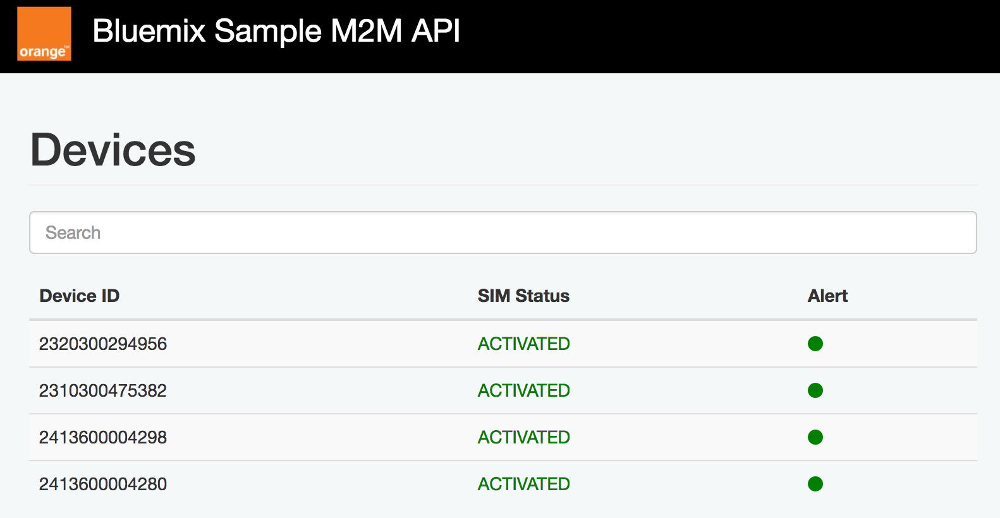

This sample demonstrates how to consume the Orange M2M API from a Node.js application.



# How to use it

1. Clone this project
1. Create an instance of the Orange service
    ```
    bx service create <service-name> <service-plan> <myservice-name>
    ```
1. Bind this service to this application by editing the **manifest.yml**
    ```yml
    ---
    applications:
    - disk_quota: 1024M
      name: orange-simpleapitest
      path: .
      buildpack: sdk-for-nodejs
      instances: 1
      memory: 256M
      services:
      - ENTER THE NAME OF YOUR SERVICE HERE
    ```
1. Push this project to Bluemix
    ```
    bx cf push
    ```
1. Go to Bluemix

# Resources
This sample contains additional API resources to retrieve SIM details in JSON format.

```http
    http://<hostname>/m2m/devices
```

```json
  {
    "sim": {
      "serialNumber": "2320300294956",
      "status": "ACTIVATED"
    }
    },
    {
      "sim": {
        "serialNumber": "2310300475382",
        "status": "ACTIVATED"
      }
    }
```

```http
    http://<hostname>/m2m/devices/<device-id>
```

```json
  {
    "customerEnvironmentIdentifier": "50000022",
      "sim": {
        "serialNumber": "2320300294956",
        "puk1": "42168269",
        "puk2": "26935883",
        "imei": "3544230215453101",
        "status": "ACTIVATED",
        "lastStatusRefreshDate": "2017-04-01T04:00:16+02:00",
        "lastStatusChangeDate": "2015-01-31T12:09:57+01:00"
      },
      "subscription": {
        "identifier": "34000324",
        "description": {
          "value": "M2M automotive",
          "service": [
          "APN orange.fr 3G",
          "roaming control option",
          "12 month test mode flag",
          "voice calls white list",
          "SMA TEST NOCATCT1            ",
          "multimedia content filtering ",
          "SMA PROD NOCATCP1            ",
          "SMA PROD NOCATCP2            ",
          "APN orange.acte 3G",
          "SMA TEST NOCATCT2            ",
          "APN orange 3G",
          "orange.m2m.spec APN          "
          ]
      },
      "creationDate": "2013-05-07T00:00:00+02:00",
      "connectionDate": "2013-05-07T00:00:00+02:00",
      "msisdnVoice": {
        "cc": "33",
        "sn": "632498745"
      }
      },
      "customerIdentifier": {
        "type": "SIREN",
        "identifier": "428706097"
    }
  }
```

# Test your API outside Bluemix
This project comes with a Postmam json file ready to test Orange API.
Make sure to update your username and password first.

# Test the UI without any access to Orange M2M API
This project contains a sample of SIM that would be return by the API.
This sample is available in the file [devices.json](./public/api/devices.json).
To test it, uncomment this line
  ```js
  $http.get("/api/devices.json").success(function (data) {
  ```
and comment this line:
  ```js
  //$http.get("/m2m/devices").success(function (data) {
  ```
